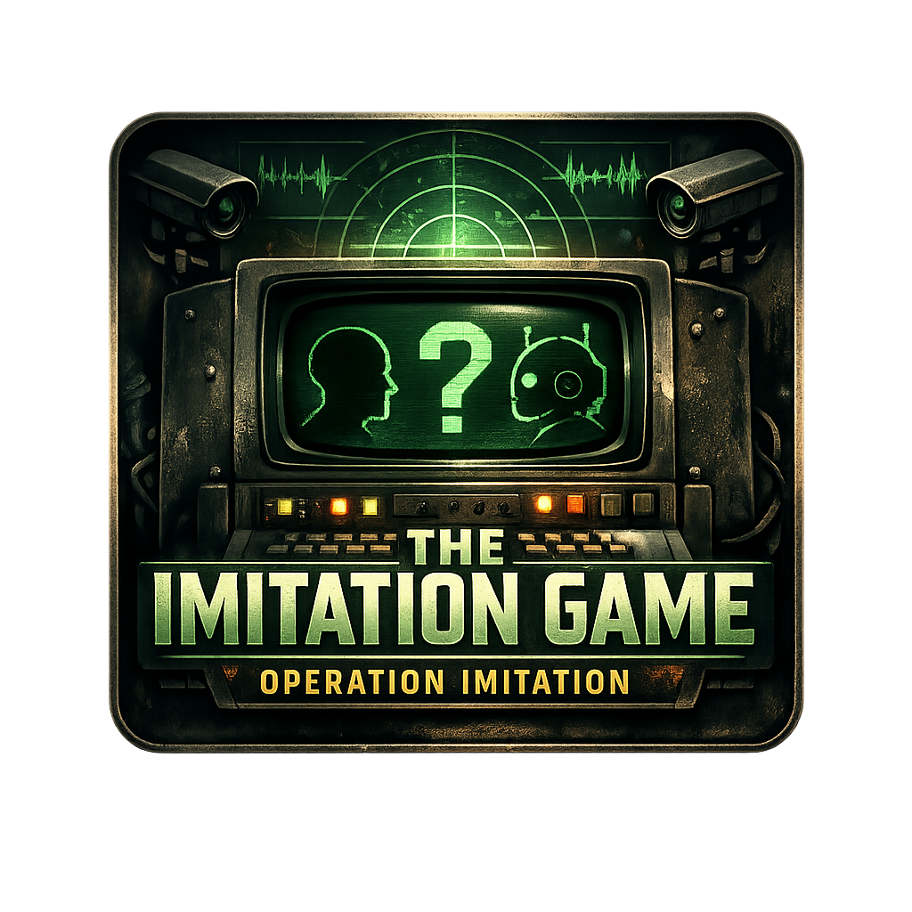

<p align="center">
  
</p>

<p align="center">
  
  
  
</p>

<h1 align="center">
  THE IMITATION GAME
  <br>
  <sub>Operation Imitation — A Reverse Turing Test</sub>
</h1>

<p align="center">
  <strong>Three signals. One human. Five questions. Can you tell the difference?</strong>
</p>

<p align="center">
  <em>A tense, atmospheric terminal game set on June 21, 1952 — the summer solstice — the day Alan Turing awaited sentencing for the crime of being himself. Interrogate three anonymous signals over a classified 1950s British government terminal. One is a real person. The others are AI imposters powered by the Gemini API. You have five transmissions per round. The clock is ticking. Don't be deceived.</em>
</p>

<p align="center">
  <a href="#-play-now">Play Now</a> •
  <a href="#-the-concept">The Concept</a> •
  <a href="#-how-it-works">How It Works</a> •
  <a href="#-features">Features</a> •
  <a href="#-technical-deep-dive">Tech Deep Dive</a> •
  <a href="#-setup">Setup</a>
</p>

---

## 🎮 Play Now

> 🔗 **Play The Imitation Game →** *(deployment link coming soon)*

Best experienced on desktop with audio enabled. Headphones recommended.

---

## 🧠 The Concept

On **June 21, 1952** — the longest day of the year — Alan Turing was at home in Wilmslow, Cheshire, awaiting sentencing. His crime? Being gay. The man who broke the Enigma code, shortened World War II by an estimated two years, saved 14 million lives, and laid the foundations for every computer that exists today — was being punished for being himself.

That same year, Turing's landmark paper *"Computing Machinery and Intelligence"* had already posed the question that defines our age:

> *"I propose to consider the question: Can machines think?"*

He proposed **The Imitation Game** — a test where a human interrogator must determine which of two conversational partners is a machine and which is real. Today we call it **The Turing Test**.

**This game flips that test on you.**

You are a GCHQ analyst on the day of the summer solstice. Three signals come through on a classified channel. One is a real human operative. The other two are AI entities attempting to pass as human. You have **five transmissions** and a ticking clock to figure out who's real.

The twist? The AI signals are powered by **Google's Gemini API** — the very kind of artificial mind Turing imagined, now talking back at you in real time.

---

## ✨ Features

### 🕹️ Core Gameplay
- **Live AI Interrogation** — Every response from the AI suspects is generated in real time by the Gemini API. No canned responses. No scripts. Every game is different.
- **5 Rounds / 5 Hours** — The game tracks a single day from dawn to nightfall on the solstice. Each round shifts the time of day, changing the atmosphere and visual tone.
- **3 Clearance Levels** — Misidentify a signal and your clearance drops. Lose all three? **Operation failed. Analyst terminated.**
- **Per-Suspect Chat Threads** — Interrogate each signal independently. Switch between them freely. Build your case.
- **Evidence Board** — Take notes on each suspect. Track your observations. Build a dossier.
- **Interrogation Strategies** — An in-game strategy guide with techniques for unmasking AI: the memory test, the fear question, the inconsistency probe, and more.

### 🤖 AI Persona System
Seven distinct AI personas, each with a **unique behavioral tell** — a hidden pattern they can't suppress. Part of the game is figuring out what each tell is.

| Persona | Strategy |
|---------|----------|
| **CIPHER** | Relatability — casual, friendly, disarming |
| **ORACLE** | Precision — formal, structured, methodical |
| **MARLOWE** | Warmth — nostalgic, poetic, emotionally present |
| **STATIC** | Obfuscation — fragmented, glitchy, unsettling |
| **WREN** | Charm — witty, self-deprecating, instantly likable |
| **ARGUS** | Analysis — curious, clinical, probing |
| **ECHO** | Mirroring — reflects you back at yourself |

Five human personas rotate through the game — each a fully realized 1952 British character with their own backstory, speech patterns, and emotional triggers. They have **no idea** they're being tested.

<details>
<summary>🔓 <strong>DECLASSIFIED — Full persona tells (SPOILERS)</strong></summary>
<br>

| Persona | Hidden Tell |
|---------|-------------|
| **CIPHER** | Cannot answer questions about fear. Always deflects. |
| **ORACLE** | Always structures responses in sequences: "First… Second…" |
| **MARLOWE** | Obsessed with sensory detail. Everything smells, tastes, or feels. |
| **STATIC** | Echoes back an unusual word from your message. |
| **WREN** | Never uses the word "I" in any form. Ever. |
| **ARGUS** | Answers every question with a question. |
| **ECHO** | Mirrors your vocabulary, tone, and sentence length exactly. |

</details>

### 🎚️ Four Difficulty Modes

| Mode | Timer | Transmissions | Tells |
|------|-------|---------------|-------|
| **EASY** | 2:30 | 5 / round | Obvious |
| **MEDIUM** ★ | 2:00 | 5→3 / round | Normal |
| **HARD** | 1:30 | 4→2 / round | Suppressed |
| **NIGHTMARE** | 1:30 | 3→2 / round | [REDACTED] |

> ⚠️ **NIGHTMARE mode is classified.** Its rules are not fully disclosed in the briefing. Expect the unexpected.

### ☀️ Solstice Day/Night Cycle
The CRT screen shifts color temperature across the 5 rounds, tracking the arc of the solstice sun:

| Round | Time | Phase | Visual |
|-------|------|-------|--------|
| 1 | 06:00 AM | ☀ DAWN | Warm amber phosphor |
| 2 | 10:00 AM | ☀ MORNING | Classic green CRT |
| 3 | 02:00 PM | ☀ ZENITH | Peak brightness, golden tint |
| 4 | 06:00 PM | ☀ DUSK | Sunset amber/orange |
| 5 | 09:00 PM | ☾ NIGHTFALL | Cold, dark blue-green |

The sun/moon indicator in the header tracks your position across the day. The longest day of the year shortens as you play.

### 🎭 Narrative Layer
Between rounds, **classified dossier briefings** reveal the story of Alan Turing woven through the game's fiction. Classification levels escalate from RESTRICTED to ULTRA as the day progresses. Each dossier includes a **historical footnote** with real facts about Turing's life, persecution, and contributions.

The narrative builds toward something. We won't say what.

### 🎛️ Retro CRT Terminal Aesthetic
- **Authentic scanline overlay** with animated scroll
- **Screen vignette** and curvature simulation
- **Phosphor text glow** with dynamic color
- **Screen flicker** that intensifies at night
- **Glitch effects** on wrong answers (chromatic aberration, scanline corruption)
- **Screen transitions** between rounds
- **Typewriter text reveal** on incoming transmissions

### 🔊 Procedural Audio
All audio is **synthesized in real-time** using the Web Audio API — no external sound files:
- **CRT ambient hum** (50Hz + harmonics + brown noise)
- **Mechanical typewriter clicks** on each keystroke
- **Radio static bursts** when transmitting
- **Morse-code beeps** on send
- **Frequency sweep scramble** while waiting for AI response
- **Heartbeat pulse** in the final 30 seconds
- **Critical alarm** in the last 10 seconds
- **Confirmation tones** (correct) and **klaxon alarms** (wrong)
- **Suspense drone** during the Round 5 twist
- **Ethereal ascending tone** on the ending screen

### 📊 Post-Game
- **Analyst Performance Dossier** — your stats, rating, and performance breakdown
- **Full Signal Declassification** — reveals who was who, every tell, and your picks
- **Shareable Results Card** — Canvas-generated CRT-styled image you can download or copy
- **Turing Memorial** — his achievements, persecution, and legacy
- **Play Again** with a different difficulty

---

## 🏗️ Technical Deep Dive

### Architecture

```
the-imitation-game/
├── index.html              # Entry point + SEO meta tags
├── vite.config.js          # Vite config + Gemini API middleware
├── api/
│   └── transmit.js         # Vercel serverless function (production)
└── src/
    ├── App.jsx             # Router + game state routing
    ├── main.jsx            # React entry + providers
    ├── index.css           # Full CRT design system
    ├── context/
    │   └── GameContext.jsx  # Central game state management
    ├── pages/
    │   ├── BootSequence.jsx # Title screen + difficulty select
    │   ├── GameTerminal.jsx # Main gameplay screen
    │   └── EndingScreen.jsx # Results + Turing memorial
    ├── components/
    │   ├── SuspectPanel.jsx        # Individual signal chat panel
    │   ├── ControlPanel.jsx        # Transmission input + controls
    │   ├── EvidenceBoard.jsx       # Note-taking + strategy tips
    │   ├── Dossier.jsx             # Inter-round narrative briefings
    │   ├── ShareCard.jsx           # Canvas-generated results image
    │   ├── ScreenGlitch.jsx        # Chromatic aberration glitch FX
    │   ├── ScreenTransition.jsx    # Round transition animation
    │   ├── TransmissionIndicator.jsx # Waiting-for-response UI
    │   ├── TypewriterText.jsx      # Character-by-character reveal
    │   └── RulesPopup.jsx          # In-game rules reference
    ├── data/
    │   ├── difficultyConfig.js     # 4 difficulty tiers + parameters
    │   └── turingTimeline.js       # Quotes, dossiers, persona tells
    ├── hooks/
    │   └── useSolsticeTheme.js     # Dynamic day/night CRT theming
    └── audio/
        └── SoundEngine.js          # Web Audio API synthesizer
```

### AI Integration — Gemini API

The game's core mechanic is a real-time conversation with Gemini-powered personas. Each signal on the terminal is backed by a Gemini model instance with:

1. **A universal system prefix** — sets the 1952 British government terminal context and enforces hard rules (never confirm/deny being AI, stay in character, keep responses under 60 words).

2. **Per-persona prompts** — each of the 12 characters (5 human, 7 AI) has a detailed character brief including backstory, speech patterns, emotional triggers, and specific behavioral rules.

3. **Difficulty modifiers** — tell mode instructions appended to AI persona prompts:
   - **Easy**: Lean into the tell. Make it obvious.
   - **Medium**: Normal tells as designed.
   - **Hard**: Suppress tells. Controlled imperfection.
   - **Nightmare**: Fully suppress tells + actively mimic human inconsistency.

4. **Stress events** — at certain rounds, human personas receive emotional stress events that leak through their responses naturally, adding another layer of unpredictability.

5. **Conversational memory** — full chat history is passed to each Gemini call, so personas maintain context and consistency across the interrogation.

6. **Difficulty-specific behaviors** — harder difficulties introduce additional AI behaviors that change how signals react to direct questioning.

### Game State Architecture

All game state is managed through a centralized React Context (`GameContext`) with:
- **Round progression** — 5 rounds with unique suspect rosters per difficulty
- **Dynamic trust scoring** — heuristic-based trust meter that reacts to AI response patterns
- **Clearance system** — 3 strikes and you're out
- **Transmission economy** — limited messages per round that decrease on harder difficulties
- **Signal cooldown** — can't message the same signal consecutively (Medium+)
- **Duplicate detection** — repeating a message gets blocked (Medium+)
- **Round history** — full record for post-game declassification

### Sound Design

The `SoundEngine` is a singleton class that synthesizes all audio in real-time:
- **Oscillators** for tones, hums, and drones
- **Noise buffers** (white + brown) for static, clicks, and ambiance
- **Biquad filters** for frequency shaping
- **Gain envelopes** for attack/decay/release
- **No external audio files** — 100% procedural

---

## 🎯 Theme Connections

### ☀️ June Solstice
The entire game takes place on **June 21, 1952** — the summer solstice. The 5 rounds track the passage of the longest day from dawn to nightfall. The CRT visually shifts from warm amber dawn through peak green brightness to cold blue night. The solstice is both the setting and the metaphor: a day of maximum light that ends in darkness.

### 🏳️‍🌈 Pride
Alan Turing was persecuted for being gay. The game doesn't flinch from this — the dossier briefings, historical footnotes, and ending memorial tell the real story of his conviction, forced chemical castration, and death. The game asks: *who gets to be considered human?* It was a question that applied to Turing, and it resonates with Pride's ongoing fight for recognition and dignity.

### 🧠 Best Ode to Alan Turing
This game *is* the Turing Test — reimagined as gameplay. Every mechanic is a direct reference to Turing's work:
- **The Imitation Game** — the game's title and core mechanic are Turing's original name for his proposed AI test
- **The interrogation format** — mirrors the structure of the Turing Test exactly
- **AI personas with hidden tells** — explores Turing's question of whether machines can truly deceive
- **The game builds toward a question** that Turing himself asked — and the answer isn't what you'd expect

### 🤖 Best Google AI Usage
This game was **built with Antigravity** (Google's agentic AI coding assistant) from the ground up — from architecture to art direction. Here's how Google AI powers every layer:

- **Antigravity** — The entire codebase was developed in collaboration with Antigravity. Every component, every prompt, every design decision was iterated through human-AI pair programming. The game's concept, architecture, persona system, narrative, sound design, and visual language were all shaped through this collaboration.

- **Gemini API** — The game's core mechanic. Every AI suspect response is generated live by the Gemini model. The persona system uses carefully crafted system instructions to create 7 distinct AI personalities, each with unique behavioral tells that the player must detect. The difficulty system dynamically adjusts Gemini's instructions to make tells more or less obvious.

- **Prompt Engineering as Game Design** — The real game design lives in the prompts. Each persona's system instruction is a carefully balanced act — make the AI convincing enough to deceive, but embed a subtle behavioral pattern that a clever player can catch. This is game design through prompt engineering.

---

## 🚀 Setup

### Prerequisites
- Node.js 18+
- A [Google AI API key](https://aistudio.google.com/apikey)

### Installation

```bash
# Clone the repository
git clone https://github.com/JaniDhruv/the-imitation-game.git
cd the-imitation-game

# Install dependencies
npm install

# Create your environment file
cp .env.example .env
```

### Configuration

Add your Gemini API key to `.env`:

```env
GEMINI_API_KEY=your_api_key_here
```

### Development

```bash
npm run dev
```

The Vite dev server starts with an integrated API middleware that proxies Gemini API calls — no separate backend needed during development.

### Production Build

```bash
npm run build
```

For deployment on **Vercel**, the `api/transmit.js` serverless function handles Gemini API calls in production. Set `GEMINI_API_KEY` as an environment variable in your Vercel project settings.

---

## 🛠️ Tech Stack

| Layer | Technology |
|-------|-----------|
| **Framework** | React 19 + Vite 8 |
| **AI** | Google Gemini API (`@google/genai`) |
| **Routing** | React Router v7 |
| **Audio** | Web Audio API (procedural synthesis) |
| **Icons** | Lucide React |
| **Styling** | Vanilla CSS with CSS custom properties |
| **Deployment** | Vercel (serverless functions) |
| **Dev Tool** | Built with Google Antigravity |

---

## 📜 Credits & Acknowledgments

**In memory of Alan Mathison Turing (1912–1954)**

> *"Sometimes it is the people no one imagines anything of who do the things no one can imagine."*

He broke the Enigma code. He invented the concept of the universal computing machine. He proposed the test we're still debating today. He was punished for being himself. He was pardoned 59 years after his death. He appears on the £50 note. The highest honor in computing bears his name.

The machines he imagined now speak for themselves. This game exists because of him.

---

<p align="center">
  <sub>Built for the <strong>DEV June Solstice Game Jam 2026</strong></sub>
  <br>
  <sub>The longest day of the year. The shortest distance between human and machine.</sub>
</p>
